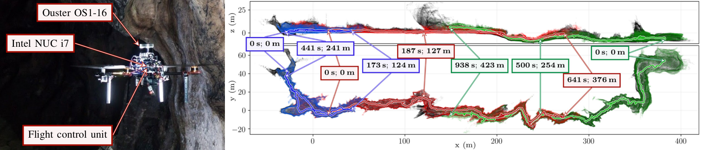

# Bull Rock Cave system

Two datasets (red and green trajectories in the figure below) recorded onboard a UAV flying within the Bull Rock Cave system in central Bohemian Karst [1].
Long flights in narrow subterranean environment, no loops, average speed ~0.5 m/s, dynamic obstacle (a safety operator walking behind the UAV).



The rosbags contain unsynchronized LiDAR points and IMU measurements.
The groundtruth trajectory was estimated ([code](https://github.com/ctu-mrs/mrs_pcl_tools/blob/master/src/executables/EstimateLidarSlamDrift.cpp)) during post-processing: registration of on-board data onto map of the cave (map registred from ~100 overlapping scans from precise Leica BLK360 3D scanner) using ICP set with high-precision parameters.

## Sensors
- OS1-16 LiDAR: 16-row point cloud with topics:
  - raw points: `/uav63/os1_cloud_node/points`
  - imu: `/uav63/os1_cloud_node/imu`

## Frames
- baselink: `uav63/fcu`
- points: `uav63/os1_lidar`
- imu: `uav63/os1_imu`
```
uav63/fcu
└───> uav63/os1_sensor
      └───> uav63/os1_lidar
      └───> uav63/os1_imu
```

## Folder structure
```
bull_rock_cave
│   download.sh
│   bull_rock_cave.pcd
│
└───0_front
│       mission_data.txt
│       trajectory_groundtruth.txt
│       rosbag.bag
│       fcu_in_map.mat
│    
└───1_back
        mission_data.txt
        trajectory_groundtruth.txt
        rosbag.bag
        fcu_in_map.mat
```
- Script to download large data: `download.sh`
  - ground truth map of the environment: `bull_rock_cave.pcd`
  - datasets: `rosbag.bag`
- Ground truth trajectory: `trajectory_groundtruth.txt`
  - in local origin (use `fcu_in_map.mat` to transform to the map frame): zero-pose initialization
  - format: `timestamp x y z qx qy qz qw`
- General mission information: `mission_data.txt`
- Initial transformation `map->uav63/fcu`: `fcu_in_map.mat`
  - 4x4 transformation matrix
 
## References
[1] Petracek, P.; Kratky, V.; Petrlik, M.; Baca, T.; Kratochvil, R.; Saska, M. *Large-Scale Exploration of Cave Environments by Unmanned Aerial Vehicles.* IEEE Robotics and Automation Letters 2021, 6, 7596–7603.
