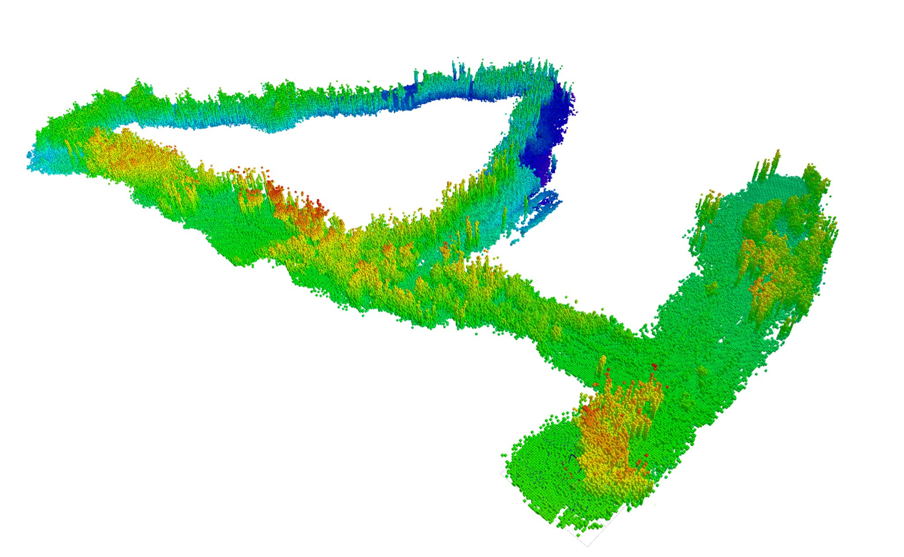

# Forest dataset

This dataset contains approx 1.25 km-long 19-minutes flight throught a sparse forest.
It was created for develoment and testing of large-scale localization and mapping techniques, that often struggle with other then the small, clean and feature-full laboratory environments.
This dataset containes intermited recording of RTG GPS with Integer FIX solution.



The rosbags contain unsynchronized LiDAR points, IMU measurements and RGBD data.
Ground thruth is provided via onboard GPS (Pixhaw) and RTK GPS (Emlid Reach) with intermitend INT FIX.

## Sensors

- OS0-128 LiDAR (128 rows, 90 deg vFoV) (top-mounted):
  - lidar packets: `/uav11/os_nodelet/lidar_packets` of type `ouster_ros/PacketMsg`
  - imu: `/uav11/os_nodelet/imu_packets` of type `ouster_ros/PacketMsg`
  - use the [ouster_ros](https://github.com/ctu-mrs/ouster/) to decode the packets into point cloud data
- Realsense d435 (forward-facing):
  - color camera: `/uav11/rgbd/color/image_raw/compressed` of type `sensor_msgs/CompressedImage`
  - depth camera: `/uav11/rgbd/aligned_depth_to_color/image_raw/compressedDepth` of type `sensor_msgs/CompressedImage`
- Garmin Lidar Lite (down-facing):
  - data: `/uav11/mavros/distance_sensor/garmin` of type `sensor_msgs/Range`

## Frames

Sensor frames:
- baselink: `uav11/body`
- points: `uav11/os_sensor/os_lidar`
- imu: `uav11/os_sensor/os_imu`
- rgbd optical: `uav11/rgbd/color_optical`
- rgbd link: `uav11/rgbd/link`
GPS frames:
- RTK frame: `uav11/rtk_origin`
- GPS frame: `uav11/gps_origin`

```
uav11/common_origin
├───> uav11/rtk_origin
│     └───> uav11/rtk_body
└───> uav11/gps_origin
      └───> uav11/gps_body

uav11/body
├───> uav11/os_sensor
│     ├───> uav11/os_lidar
│     └───> uav11/os_imu
├───> uav11/rgbd/color_optical
├───> uav11/rgbd/link
└───> uav11/garmin
```

If needed, connect the `uav11/body` under, e.g., the `uav11/rtk_origin` frame using the static transform publisher:

```bash
rosrun tf2_ros static_transform_publisher 0 0 0 0 0 0 $UAV_NAME/rtk_body $UAV_NAME/body
```

## Ground truth odometries

GPS Pixhawk odometry:

- standard GPS precision, includes covariance
- topic `/uav11/odometry/odom_gps_pixhawk` of type `nav_msgs/Odometry`
- topic `/uav11/odometry/marker_gps` of type `visualization_msgs/Marker`
  - visualization of the path, blue

GPS RTK Emlid Reach:

- intermitent RTK FIX precision, includes covariance
- topic `/uav11/odometry/odom_rtk_int` of type `nav_msgs/Odometry`
  - published during the RTK L1_INT Fix (supposingly 2 cm accuracy)
- topic `/uav11/odometry/odom_rtk_float` of type `nav_msgs/Odometry`
  - published during the RTK L1_FLOAT (somewhat within 4 m accuracy, but might be better)
- topic `/uav11/odometry/odom_rtk_single` of type `nav_msgs/Odometry`
  - not RTK, published during the RTK SINGLE (within 4 m accuracy)
- topic `/uav11/odometry/odom_rtk_any` of type `nav_msgs/Odometry`
  - published during all precision modes
- topic `/uav11/odometry/marker_rtk` of type `visualization_msgs/Marker`
  - visualization of the path, green = fix, red = other

## Multimedia

### Photo of the UAV


### Hand-held video of the flight

Located in `forest.mp4` after calling `./download.sh`.
