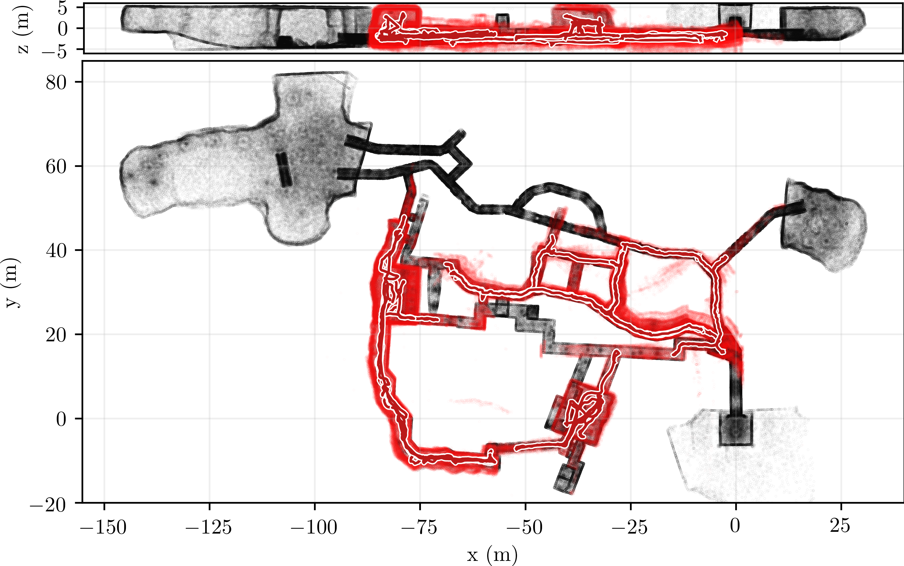

# DARPA Subterranean Challenge: Finals

Datasets recorded onboard an autonomous UAV system (describe in [1, 2]) deployed within the environment of the DARPA Subterranean Challenge Finals (post-event testing).
Contains mid-range flights in extremely narrow subterranean environments, with perceptual degradation from whirling dust, no dynamic obstacles, one mine-cave-mine loop, average speed ~0.5 m/s.


The rosbags contain unsynchronized LiDAR points and image streams of two cameras.
The groundtruth trajectory was estimated ([code](https://github.com/ctu-mrs/mrs_pcl_tools/blob/master/src/executables/EstimateLidarSlamDrift.cpp)) during post-processing: registration of on-board data onto the map of the environment using ICP set with high-precision parameters.

## Datasets
| Dataset        | Length (m, s)    | Environment       | Loop   | Dust noise       | Autonomy                               | GoPro                                  |
| ---------      | ---------------- | ----------------- | ------ | ---------------- | -------------------------------------- | -------------------------------------- |
| uav21_2        | 306, 757         | metro             | no     | no               | [link](https://youtu.be/tkGsCteX3Ns)   | N/A                                    |
| uav21_3        | 23, 58           | cave              | no     | no               | [link](https://youtu.be/OOW50sTCzLY)   | N/A                                    |
| uav21_4        | 196, 432         | mine              | no     | yes              | [link](https://youtu.be/sCGyxbgCa_E)   | N/A                                    |
| uav21_5        | 377, 914         | metro             | no     | no               | [link](https://youtu.be/alTvBpJoxpw)   | N/A                                    |
| uav21_6        | 164, 432         | mine and cave     | yes    | yes              | [link](https://youtu.be/WG3CthG6XuU)   | [link](https://youtu.be/7MFX66mnS50)   |
| uav22_1        | 131, 332         | mine              | no     | yes              | [link](https://youtu.be/u2O5nsBRvBU)   | N/A                                    |
| uav22_2        | 347, 347         | mine              | no     | yes              | [link](https://youtu.be/MNnfMZDNs-w)   | [link](https://youtu.be/H9P09uPBGps)   |
| uav22_3        | 266, 644         | metro             | no     | no               | [link](https://youtu.be/HepOcH5c1Jg)   | N/A                                    |
| uav24_1        | 162, 475         | urban storeroom   | no     | no               | [link](https://youtu.be/lcehGjB4-HI)   | [link](https://youtu.be/aFqolM6R-4s)   |

## Sensors
- OS0-128 LiDAR (128 rows, 90 deg vFoV) topics:
  - raw points: `/UAV_NAME/os_cloud_nodelet/points` of type `sensor_msgs/PointCloud2`
    - to filter out the UAV frame, use points with minimal distance of `0.5 m` from the sensor origin
  - processed points: `/UAV_NAME/os_cloud_nodelet/points_processed` of type `sensor_msgs/PointCloud2`
    - 32 rows (every 4-th row of raw data, evenly spaced), filtered UAV frame, filtered dust
- Basler RGB cameras:
  - resolution: `600 x 800 px`
  - two cameras [`basler_left`, `basler_right`]
  - camera_info: `/UAV_NAME/basler_X/image_raw/camera_info` of type `sensor_msgs/CameraInfo`
  - image: `/UAV_NAME/basler_X/image_raw/compressed` of type `sensor_msgs/CompressedImage`


## Frames
- baselink: `UAV_NAME/fcu`
- points: `UAV_NAME/os_lidar`
- camera `basler_X` [`basler_left`, `basler_right`]:
  - optical frame: `UAV_NAME/basler_X_optical`
  - ROS frame: `UAV_NAME/basler_X`
```
UAV_NAME/fcu
└───> UAV_NAME/os_sensor
      └───> UAV_NAME/os_lidar
      └───> UAV_NAME/basler_X_optical
      └───> UAV_NAME/basler_X
```

## Folder structure
```
subt_finals
│   download.sh
│   subt_finals.pcd
│
└───DATASET
│       trajectory_groundtruth.txt
│       rosbag.bag
│       fcu_in_map.mat
└───...
```
- Script to download large data: `download.sh`
  - ground truth map of the environment: `subt_finals.pcd`
  - datasets: `rosbag.bag`
- Ground truth trajectory: `trajectory_groundtruth.txt`
  - in local origin (use `fcu_in_map.mat` to transform to the map frame): zero-pose initialization
  - format: `timestamp x y z qx qy qz qw`
- General mission information: `mission_data.txt`
- Initial transformation `map->UAV_NAME/fcu`: `fcu_in_map.mat`
  - 4x4 transformation matrix
 
## References
- [1] Petracek, P.; Kratky, V.; Petrlik, M.; Baca, T.; Kratochvil, R.; Saska, M. *Large-Scale Exploration of Cave Environments by Unmanned Aerial Vehicles,* IEEE Robotics and Automation Letters 2021, 6, 7596–7603.
- [2] V. Kratky, P. Petracek, T. Baca and M. Saska, *An autonomous unmanned aerial vehicle system for fast exploration of large complex indoor environments,* Journal of field robotics, May 2021.
